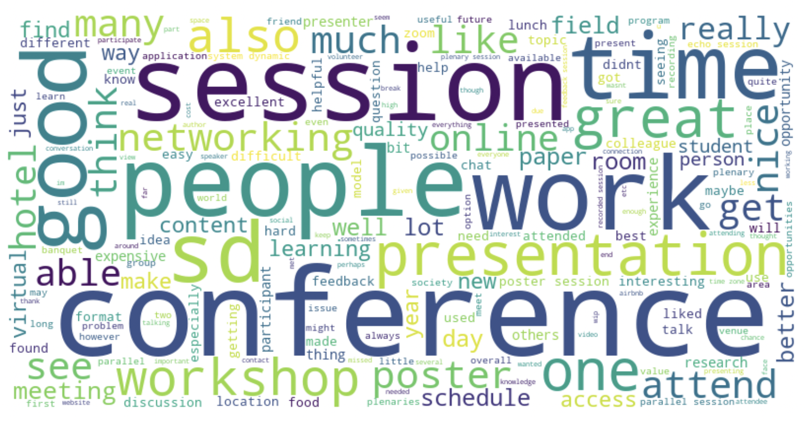
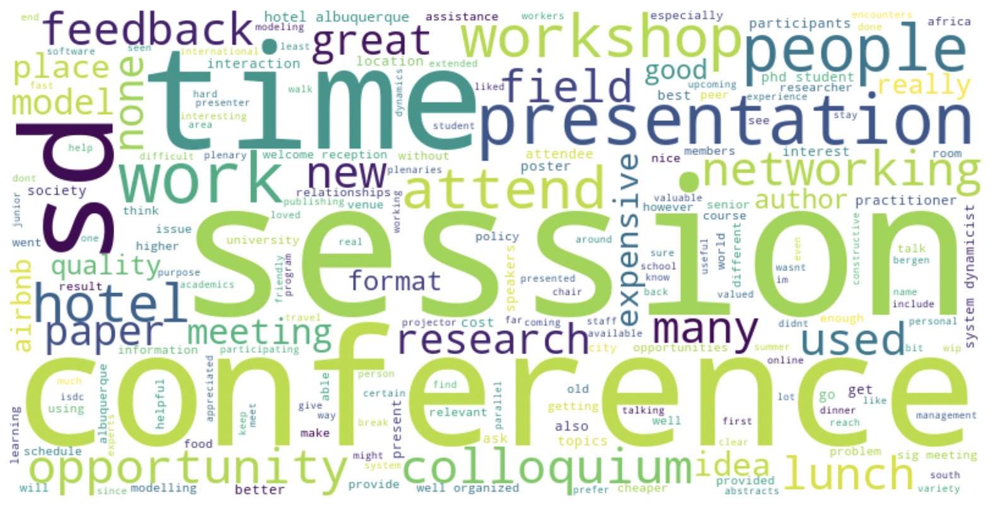
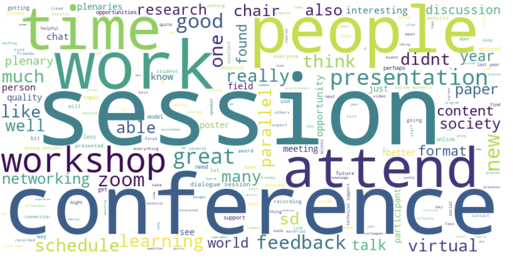
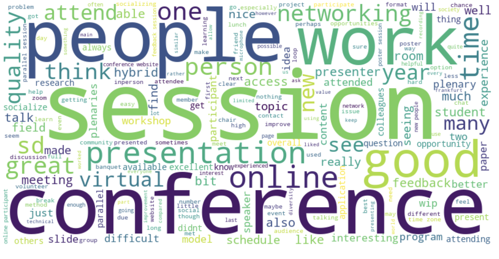

# Numerical Analysis

## Techniques used:
-Gathered data and plotted weighted averages over the years as trend diagrams
-Looked at in person to virtual and virtual to hybrid transitions to see what trends were statistically significany

# Categorical Analysis

## Techniques used:
-Gathered data and plotted weighted averages over the years as trend diagrams

# Boolean Analysis

## Techniques used:
-Gathered data and plotted weighted averages over the years as trend diagrams

# Text Analysis

## Techniques used:

- General pandas, numpy, re, ast, processing, wrangling: lambda functions, list comprehension, etc. 
- Textblob library sentiment analysis to classify responses into positive, negative, and neutral
- TF-IDF Vectorization to extract keywords and n-grams from the text
- Latent Dirichlet Allocation(LDA) topic modeling, to get representative responses for each topics
- Named Entity Recognition(NER) with spaCy library to find important entities
- LDA also used to get top words for each topic and guess binding topic categories
- WordClouds for graphic show of most common non trivial words

## Results

## Word clouds:

Overall Wordcloud

Wordcloud for In person event - 2019

Wordcloud for Virtual event - 2021

Wordvloud for Hybrid event - 2022

# Data Sentiment Analysis

## Overall Data Sentiment Analysis

- Positive: 1517
- Negative: 261
- Neutral: 1125

## Best Thing That Happened to You Data Sentiment Analysis

First few responses:

- "I could meet for the first time with people that I've met regularly but only online."
- "Expanding my perspective with studies in many fields."
- "I got to present at a parallel session which was my first experience presenting as well as doing so online at ISDC."
- "Yaman's talk was inspiring to me. John Sterman's plenary."
- "Seeing that my volunteering work helped make the hybrid conference successful."

- Positive: 200
- Negative: 8
- Neutral: 139

## Worst Thing That Happened to You Data Sentiment Analysis

First few responses:

- "Not having feedback or not having enough time to talk and learn from experts."
- "Time zone conflict between Frankfurt and US Mountain."
- "I was planning to join in person but could not and was quite upset about it and the FOMO of not being able to attend the banquet as well as socials with people present in person."
- "None."
- "Going to sleep during a session entirely due to time zone differences."

- Positive: 93
- Negative: 65
- Neutral: 150

# Keyword Analysis - Through sentiment analysis

## One Word Keywords

| Good Term  | Importance |
| ---------- | ---------- |
| sessions   | 0.029851   |
| great      | 0.027946   |
| good       | 0.027821   |
| conference | 0.027390   |
| people     | 0.026458   |

| Bad Term   | Importance |
| ---------- | ---------- |
| difficult  | 0.033215   |
| conference | 0.032399   |
| expensive  | 0.031004   |
| sessions   | 0.028219   |
| time       | 0.027320   |

## Two Word Keywords

| Good Term         | Importance |
| ----------------- | ---------- |
| recorded sessions | 0.003788   |
| new people        | 0.003722   |
| parallel sessions | 0.003716   |
| learning new      | 0.003332   |
| great job         | 0.003112   |

| Bad Term            | Importance |
| ------------------- | ---------- |
| difficult navigate  | 0.012097   |
| time zone           | 0.007955   |
| bad happened        | 0.006466   |
| conference schedule | 0.005614   |
| expensive location  | 0.005103   |

## Three Word Keywords

| Good Term                           | Importance |
| ----------------------------------- | ---------- |
| meeting new people                  | 0.002217   |
| learning new things                 | 0.001403   |
| format increases facilitates        | 0.001076   |
| increases facilitates participation | 0.001076   |
| conference believe virtual          | 0.001076   |

| Bad Term                            | Importance |
| ----------------------------------- | ---------- |
| virtual participation socializing   | 0.004199   |
| participation socializing difficult | 0.004199   |
| missing sessions timing             | 0.003831   |
| getting tired absorb                | 0.003831   |
| portion lunches small               | 0.003831   |

## LDA Topic modeling with 3 components over all responses:

## Correlated Topics

### Topic 1: Conference Venue, Catering, and Attendee Feedback

- hotel
- feedback
- food
- workshops
- location
- posters
- lunch
- airbnb
- schedule
- research

### Topic 2: Accommodation, Business Amenities, and Travel Logistics

- hotel
- room
- business
- lunch
- excellent
- food
- posters
- use
- travel
- boston

### Topic 3: Virtual Conference Experience and Accessibility

- virtual
- able
- zoom
- schedule
- person
- format
- access
- workshops
- echo
- feedback

## Important terms by year discovered through TF-IDF

| Year | Keywords                                                                      |
| ---- | ----------------------------------------------------------------------------- |
| 2022 | 'virtual', 'hybrid', 'person', 'technical', 'feedback', 'website', 'access'   |
| 2021 | 'zoom', 'virtual', 'feedback', 'technical', 'workshops', 'schedule', 'dialog' |
| 2020 | 'virtual', 'echo', 'zoom', 'recorded', 'able', 'chat', 'format'               |
| 2019 | 'albuquerque', 'hotel', 'colloquium', 'workshops', 'lunch', 'none', 'airbnb'  |
| 2018 | 'feedback', 'airbnb', 'hostel', 'iceland', 'location', 'wip', 'hotel'         |
| 2016 | 'hotel', 'delft', 'food', 'posters', 'dinner', 'colleagues', 'location'       |
| 2015 | 'hotel', 'hyatt', 'total', 'responses', 'cambridge', 'room', 'isolated'       |
| 2014 | 'lunch', 'easy', 'venue', 'view', 'posters', 'delft', 'hotel'                 |
| 2013 | 'hotel', 'room', 'mit', 'lunch', 'business', 'posters', 'excellent'           |

## Important entites discovered through NER(Named Entity Recognition) with spaCy

| Keyword   | Frequency |
| --------- | --------- |
| phd       | 33        |
| summer    | 25        |
| isdc      | 18        |
| wip       | 17        |
| boston    | 14        |
| europe    | 13        |
| cambridge | 12        |
| inperson  | 9         |
| frankfurt | 8         |
| sunday    | 8         |

## Necessary Changes

The changes are necessary for the following reasons, as uncovered by the text analysis:

The analysis showed that attendees valued networking but found it difficult to have one-to-one or small group interactions in the virtual platform. This indicates a need to improve virtual interaction features.

Attendees expressed concerns about the venue's isolation and lack of nearby dining options, indicating a need for a more accessible and convenient location.

The analysis revealed concerns about high registration and hotel fees, indicating a need to make the conference more affordable.

Some attendees expressed disappointment with the quality and relevance of sessions and feedback, indicating a need for a more rigorous selection and review process.

Specific concerns were raised about the summer school and banquet, indicating a need to gather more detailed feedback and address these issues.

The text analysis did not directly address this, but enhancing the online experience is crucial in the current trend towards virtual and hybrid conferences.

## Suggestions

### Enhance Virtual Interaction

- Add features for private and small group discussions in the virtual platform.

### Select Accessible Venue

- Choose a central location with public transport and dining options.

### Reduce Costs

- Offer tiered registration fees, early-bird discounts, and scholarships.

### Improve Session Quality

- Implement a rigorous review process for presentations and provide clear guidelines for feedback.

### Address Event Concerns

- Gather detailed feedback on the summer school and banquet to address specific issues.

### Improve Online Experience

- Incorporate interactive elements in virtual sessions and make recordings available post-conference.

Implementing these recommendations will improve the attendee experience and the success of future conferences.

Understand that these suggestions come with a caveat as the vast majority of attendees responses were very posistive and there could be adverse selection in which attendants filled out the survey.
