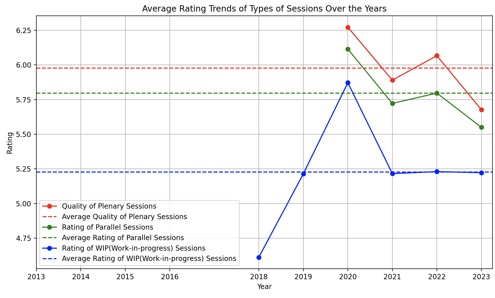
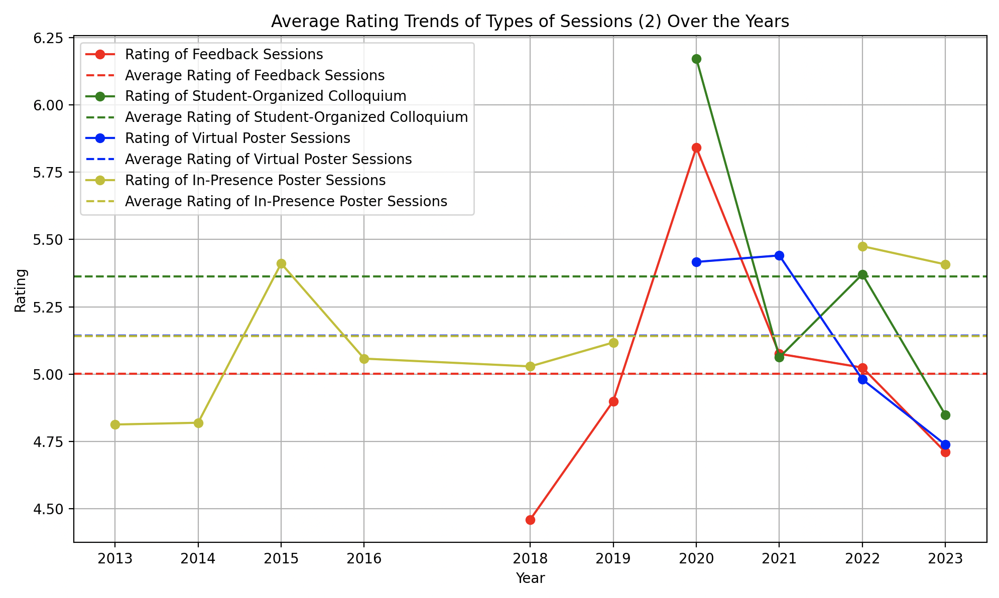
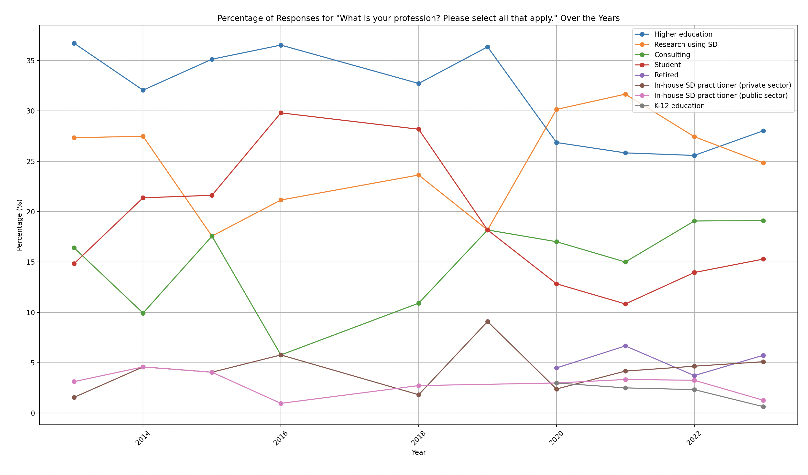
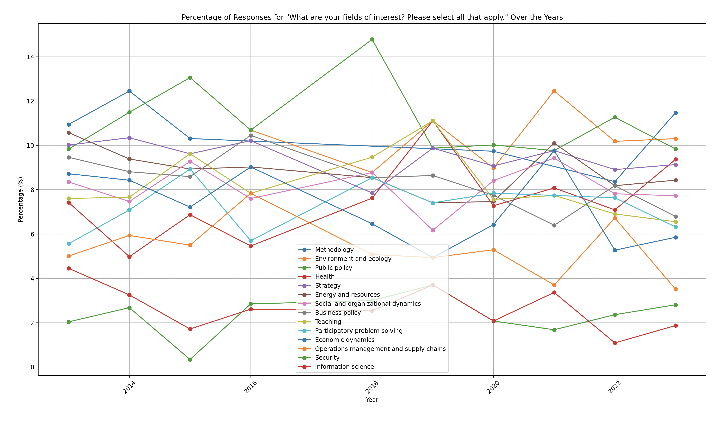
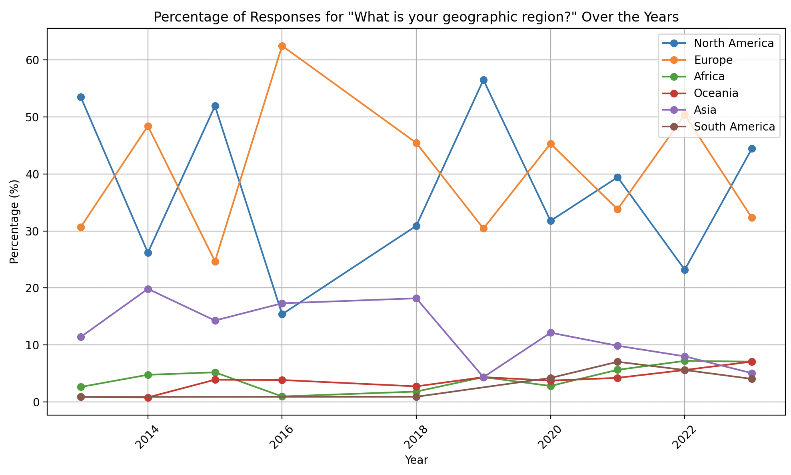

# Numerical Analysis

## Techniques used:

- Gathered data and plotted weighted averages over the years as trend diagrams
- Looked at in person to virtual and virtual to hybrid transitions to see what trends were statistically significant

## Trend diagrams:

Insights

- The number of survey responses has been relatively stable over the years
- The outliers are very few survey takers in 2019 and very many survey takers in 2020, this could be due to the format of the conferences during these years

Insights

- The overall conference value and quality of presented work have been consistently high over the years, with average ratings around 5.95 and 5.94, respectively
- There has been a slight downtrend in recent years, and we should inspect this further

Insights

- The quality of services provided by the conference organization, including technical support, has been consistently rated around 6 (on a scale of 1 to 7) over the years. There are minor fluctuations, but the overall trend is quite stable.
- The quality of socialization opportunities at the conference has seen a decline since the transition to virtual and hybrid environments, but is making a return with more in person events.
- The rating of the conference's geographical location varies significantly from year to year, with no clear trend.

Insights

- The quality of the conference venue (building and facilities) has been consistently rated around 5.5 over the years, with slight fluctuations.
- The rating of the conference fee has seen a slight decline over the years, from around 5.5 to just below 5. This suggests that attendees may be finding the conference fee too high recently.
- The rating of the overnight accommodation has been quite variable, with a significant dip in 2018 but otherwise remaining around 5.4.

Insights

- The rating of the quality of the sessions seem to trend together, with small differences.
- The rating of WIP (Work-in-progress) sessions has been quite stable over the years, remaining around 5.25.

Insights

- The rating of Feedback Sessions, Student-Organized Colloquium, Virtual Poster Sessions, and In-Presence Poster Sessions seem to be less valuable than the Plenary and parallel sessions, as these four session formats tend to vary between an approval rating of 5.0 and 5.5
- There are significant fluctuations from year to year, but it is hard to discern a certain pattern.

## Insights

- There isn't enough data to make significant claims about the trends of ratings of Roundtables, Online Workshops, Hybrid Workshops, and Dialog Sessions.
- However it seems that with the introduction of hybrid workshops, the online workshops are less appealing

## Insights

- These ratings have remained quite stable over the years
- People generally want a slightly more plenary and parallel sessions, with the parallel sessions to be slightly longer and the plenary sessions be shorter.

## Insights

- These ratings have remained stable over the years.
- People generally are satisified with the workshops and think the breaks are a bit too long and want to see a bit more academic work.

## Shifts from In Person to Virtual and Virtual to Hybrid

In Person to Virtual(2019->2020)
| Aspect | P-value |
|----------------------------------------------|----------------------------|
| Conference Program | 0.27505133557392003 |
| Services Provided | 0.0016128280780466115 |
| Opportunity to Socialize | 0.00043565698708557466 |
| Overall Conference Value | 0.16234774945772223 |
| WIP Sessions | 0.06245843923385839 |
| Feedback Sessions | 0.15886499517387664 |
| Overall Quality of Presented Work | 0.0012851427890954858 |

- Significant differences are in Opportunities to socialize(went down), services including techical support(went up), and overall quality of presented work(went up)

Virtual to Hybrid(2021-2022)
| Aspect | P-value |
|----------------------------------------------|----------------------------|
| Conference Program | 0.05661157869320761 |
| Conference Website and Access | 0.2074564956037631 |
| Services Provided | 0.19883921437196705 |
| Opportunity to Socialize | 0.03214420226557648 |
| Overall Conference Value | 0.14808913863450685 |
| Plenary Sessions | 0.18731611396871084 |
| Parallel Sessions | 0.6351484645609424 |
| WIP Sessions | 0.7687559578688791 |
| Feedback Sessions | 0.8496341358551341 |
| Student-Organized Colloquium | 0.1265650572928322 |
| Virtual Poster Sessions | 0.28475043430487246 |
| Online Workshops | 0.8628103932564655 |
| Overall Quality of Presented Work | 0.13277746916204475 |

- Significant: Opportunity to socialize at conference: 0.03214420226557648(Went up)

# Categorical Analysis

## Techniques used:

-Gathered data and plotted weighted averages over the years as trend diagrams

## Trend diagrams:

## Insights

-

## Insights

-

## Insights

-

## Insights

-

## Insights

-

# Boolean Analysis

## Techniques used:

-Gathered data and plotted weighted averages over the years as trend diagrams

## Trend diagrams:

## Insights

-

# Text Analysis

## Techniques used:

- General pandas, numpy, re, ast, processing, wrangling: lambda functions, list comprehension, etc.
- Textblob library sentiment analysis to classify responses into positive, negative, and neutral
- TF-IDF Vectorization to extract keywords and n-grams from the text
- Latent Dirichlet Allocation(LDA) topic modeling, to get representative responses for each topics
- Named Entity Recognition(NER) with spaCy library to find important entities
- LDA also used to get top words for each topic and guess binding topic categories
- WordClouds for graphic show of most common non trivial words

## Results

## Word clouds:

Overall Wordcloud

Wordcloud for In person event - 2019

Wordcloud for Virtual event - 2021

Wordvloud for Hybrid event - 2022

# Data Sentiment Analysis

## Overall Data Sentiment Analysis

- Positive: 1517
- Negative: 261
- Neutral: 1125

## Best Thing That Happened to You Data Sentiment Analysis

First few responses:

- "I could meet for the first time with people that I've met regularly but only online."
- "Expanding my perspective with studies in many fields."
- "I got to present at a parallel session which was my first experience presenting as well as doing so online at ISDC."
- "Yaman's talk was inspiring to me. John Sterman's plenary."
- "Seeing that my volunteering work helped make the hybrid conference successful."

- Positive: 200
- Negative: 8
- Neutral: 139

## Worst Thing That Happened to You Data Sentiment Analysis

First few responses:

- "Not having feedback or not having enough time to talk and learn from experts."
- "Time zone conflict between Frankfurt and US Mountain."
- "I was planning to join in person but could not and was quite upset about it and the FOMO of not being able to attend the banquet as well as socials with people present in person."
- "None."
- "Going to sleep during a session entirely due to time zone differences."

- Positive: 93
- Negative: 65
- Neutral: 150

# Keyword Analysis - Through sentiment analysis

## One Word Keywords

| Good Term  | Importance |
| ---------- | ---------- |
| sessions   | 0.029851   |
| great      | 0.027946   |
| good       | 0.027821   |
| conference | 0.027390   |
| people     | 0.026458   |

| Bad Term   | Importance |
| ---------- | ---------- |
| difficult  | 0.033215   |
| conference | 0.032399   |
| expensive  | 0.031004   |
| sessions   | 0.028219   |
| time       | 0.027320   |

## Two Word Keywords

| Good Term         | Importance |
| ----------------- | ---------- |
| recorded sessions | 0.003788   |
| new people        | 0.003722   |
| parallel sessions | 0.003716   |
| learning new      | 0.003332   |
| great job         | 0.003112   |

| Bad Term            | Importance |
| ------------------- | ---------- |
| difficult navigate  | 0.012097   |
| time zone           | 0.007955   |
| bad happened        | 0.006466   |
| conference schedule | 0.005614   |
| expensive location  | 0.005103   |

## Three Word Keywords

| Good Term                           | Importance |
| ----------------------------------- | ---------- |
| meeting new people                  | 0.002217   |
| learning new things                 | 0.001403   |
| format increases facilitates        | 0.001076   |
| increases facilitates participation | 0.001076   |
| conference believe virtual          | 0.001076   |

| Bad Term                            | Importance |
| ----------------------------------- | ---------- |
| virtual participation socializing   | 0.004199   |
| participation socializing difficult | 0.004199   |
| missing sessions timing             | 0.003831   |
| getting tired absorb                | 0.003831   |
| portion lunches small               | 0.003831   |

## By Year for the last three years:

# 2023:

| Good Term              | Importance |
| ---------------------- | ---------- |
| meeting new people     | 0.017112   |
| new people learning    | 0.008770   |
| new work networking    | 0.006263   |
| good new work          | 0.006263   |
| colleagues meeting new | 0.006125   |

| Bad Term                     | Importance |
| ---------------------------- | ---------- |
| expensive covered university | 0.027027   |
| year conference expensive    | 0.027027   |
| lack meals frustrating       | 0.027027   |
| connect community way        | 0.027027   |
| virtual format easy          | 0.019111   |

Positive Responses: 181
Negative Responses: 37
Neutral Responses: 204

# 2022:

| Good Term                       | Importance |
| ------------------------------- | ---------- |
| did great job                   | 0.003888   |
| excellent plenary talks         | 0.003606   |
| possibility slides participants | 0.003521   |
| feedback sessions included      | 0.003521   |
| did feedback presentation       | 0.003521   |

| Bad Term                            | Importance |
| ----------------------------------- | ---------- |
| participation socializing difficult | 0.019794   |
| virtual participation socializing   | 0.019794   |
| qualifies bad bad                   | 0.018182   |
| catering terrible opinion           | 0.018182   |
| website bit slow                    | 0.018182   |

Positive Responses: 284
Negative Responses: 55
Neutral Responses: 207

# 2021:

| Good Term                      | Importance |
| ------------------------------ | ---------- |
| wasnt kind event               | 0.006494   |
| schedule somewhat overwhelming | 0.006494   |
| technical support friendly     | 0.006494   |
| im new contribute              | 0.006494   |
| think trend positive           | 0.006494   |

| Bad Term                     | Importance |
| ---------------------------- | ---------- |
| did previous comments        | 0.050000   |
| zone things difficult        | 0.035355   |
| time zone things             | 0.035355   |
| difficult navigate times     | 0.035355   |
| socialize virtual conference | 0.035355   |

Positive Responses: 154
Negative Responses: 20
Neutral Responses: 105

## LDA Topic modeling with 3 components over all responses:

## Correlated Topics

### Topic 1: Conference Venue, Catering, and Attendee Feedback

- hotel
- feedback
- food
- workshops
- location
- posters
- lunch
- airbnb
- schedule
- research

### Topic 2: Accommodation, Business Amenities, and Travel Logistics

- hotel
- room
- business
- lunch
- excellent
- food
- posters
- use
- travel
- boston

### Topic 3: Virtual Conference Experience and Accessibility

- virtual
- able
- zoom
- schedule
- person
- format
- access
- workshops
- echo
- feedback

## Important terms by year discovered through TF-IDF

| Year | Keywords                                                                      |
| ---- | ----------------------------------------------------------------------------- |
| 2023 | 'people', 'conference', 'sessions', 'work', 'virtual', 'online', 'meeting'    |
| 2022 | 'virtual', 'hybrid', 'person', 'technical', 'feedback', 'website', 'access'   |
| 2021 | 'zoom', 'virtual', 'feedback', 'technical', 'workshops', 'schedule', 'dialog' |
| 2020 | 'virtual', 'echo', 'zoom', 'recorded', 'able', 'chat', 'format'               |
| 2019 | 'albuquerque', 'hotel', 'colloquium', 'workshops', 'lunch', 'none', 'airbnb'  |
| 2018 | 'feedback', 'airbnb', 'hostel', 'iceland', 'location', 'wip', 'hotel'         |
| 2016 | 'hotel', 'delft', 'food', 'posters', 'dinner', 'colleagues', 'location'       |
| 2015 | 'hotel', 'hyatt', 'total', 'responses', 'cambridge', 'room', 'isolated'       |
| 2014 | 'lunch', 'easy', 'venue', 'view', 'posters', 'delft', 'hotel'                 |
| 2013 | 'hotel', 'room', 'mit', 'lunch', 'business', 'posters', 'excellent'           |

## Important entites discovered through NER(Named Entity Recognition) with spaCy

| Keyword   | Frequency |
| --------- | --------- |
| phd       | 33        |
| summer    | 25        |
| isdc      | 18        |
| wip       | 17        |
| boston    | 14        |
| europe    | 13        |
| cambridge | 12        |
| inperson  | 9         |
| frankfurt | 8         |
| sunday    | 8         |

## Necessary Changes

The changes are necessary for the following reasons, as uncovered by the text analysis:

The analysis showed that attendees valued networking but found it difficult to have one-to-one or small group interactions in the virtual platform. This indicates a need to improve virtual interaction features.

Attendees expressed concerns about the venue's isolation and lack of nearby dining options, indicating a need for a more accessible and convenient location.

The analysis revealed concerns about high registration and hotel fees, indicating a need to make the conference more affordable.

Some attendees expressed disappointment with the quality and relevance of sessions and feedback, indicating a need for a more rigorous selection and review process.

Specific concerns were raised about the summer school and banquet, indicating a need to gather more detailed feedback and address these issues.

The text analysis did not directly address this, but enhancing the online experience is crucial in the current trend towards virtual and hybrid conferences.

## Suggestions

### Enhance Virtual Interaction

- Add features for private and small group discussions in the virtual platform.

### Select Accessible Venue

- Choose a central location with public transport and dining options.

### Reduce Costs

- Offer tiered registration fees, early-bird discounts, and scholarships.

### Improve Session Quality

- Implement a rigorous review process for presentations and provide clear guidelines for feedback.

### Address Event Concerns

- Gather detailed feedback on the summer school and banquet to address specific issues.

### Improve Online Experience

- Incorporate interactive elements in virtual sessions and make recordings available post-conference.

Implementing these recommendations will improve the attendee experience and the success of future conferences.

Understand that these suggestions come with a caveat as the vast majority of attendees responses were very posistive and there could be adverse selection in which attendants filled out the survey.
